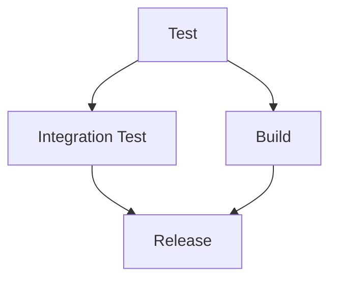
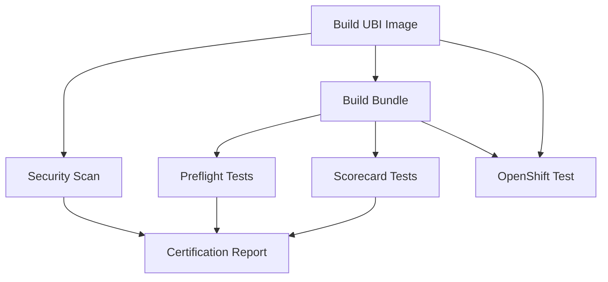

# GitHub Workflows Documentation

This document describes the GitHub workflows used in the Neo4j Kubernetes Operator project, including cluster setup, secrets management, and connectivity checks.

## Overview

The project uses several GitHub workflows for CI/CD, testing, and deployment:

- **CI Workflow** (`ci.yml`): Main continuous integration pipeline
- **Static Analysis** (`static-analysis.yml`): Code quality and security checks
- **OpenShift Certification** (`openshift-certification.yml`): OpenShift compatibility testing
- **Cluster Connectivity Test** (`cluster-test.yml`): Reusable cluster testing workflow

## Cluster Setup and Connectivity

### Kind Cluster (Local Development)

The CI workflow uses Kind (Kubernetes in Docker) for local testing:

```yaml
- name: Create k8s Kind Cluster
  uses: helm/kind-action@v1.10.0
  with:
    cluster_name: neo4j-operator-test
    config: hack/kind-config.yaml
```

**Connectivity Checks:**
- `kubectl cluster-info`: Verifies cluster API server is accessible
- `kubectl wait --for=condition=ready nodes --all`: Ensures all nodes are ready
- `kubectl get nodes -o wide`: Shows detailed node information
- `kubectl get pods -n kube-system`: Verifies system components are running

### OpenShift Cluster (Remote)

The OpenShift certification workflow connects to remote OpenShift clusters:

```yaml
- name: Validate OpenShift credentials
  run: |
    if [ -z "${{ secrets.OPENSHIFT_SERVER }}" ] || [ -z "${{ secrets.OPENSHIFT_TOKEN }}" ]; then
      echo "❌ OpenShift cluster credentials not available"
      exit 0
    fi
```

**Connectivity Checks:**
- `oc cluster-info`: Verifies OpenShift API server is accessible
- `oc get nodes`: Shows cluster node status
- `oc get projects`: Lists available projects/namespaces

## Required Secrets

### GitHub Secrets

| Secret Name | Description | Required For | Example |
|-------------|-------------|--------------|---------|
| `GITHUB_TOKEN` | GitHub API token for registry access | CI, Release | Auto-provided by GitHub |
| `QUAY_USERNAME` | Quay.io registry username | OpenShift Certification | `your-quay-username` |
| `QUAY_PASSWORD` | Quay.io registry password/token | OpenShift Certification | `your-quay-token` |
| `OPENSHIFT_SERVER` | OpenShift cluster API server URL | OpenShift Certification | `https://api.cluster.example.com:6443` |
| `OPENSHIFT_TOKEN` | OpenShift cluster access token | OpenShift Certification | `sha256~...` |

### Environment Variables

| Variable | Description | Default | Usage |
|----------|-------------|---------|-------|
| `GO_VERSION` | Go version for builds | `1.24` | All workflows |
| `REGISTRY` | Container registry | `ghcr.io` | CI, `quay.io` | OpenShift |
| `IMAGE_NAME` | Container image name | `${{ github.repository }}` | CI |
| `BUNDLE_NAME` | OLM bundle name | `neo4j/neo4j-operator-bundle` | OpenShift |

## Workflow Dependencies

### CI Workflow Dependencies


### OpenShift Certification Dependencies


## Fail-Fast Mechanisms

### Cluster Connectivity Checks

All workflows include fail-fast mechanisms to detect cluster issues early:

1. **Credential Validation**: Check if required secrets are available before attempting cluster operations
2. **API Server Connectivity**: Test cluster API server responsiveness
3. **Node Readiness**: Wait for all cluster nodes to be ready
4. **Component Health**: Verify core system components are running

### Example Fail-Fast Implementation

```yaml
- name: Validate cluster connectivity
  run: |
    # Test basic connectivity
    kubectl cluster-info || exit 1

    # Check node readiness
    kubectl wait --for=condition=ready nodes --all --timeout=300s || exit 1

    # Verify API server health
    kubectl get --raw /healthz || exit 1
```

## Troubleshooting

### Common Issues

1. **Cluster Creation Fails**
   - Check Docker daemon is running
   - Verify sufficient system resources
   - Review Kind configuration in `hack/kind-config.yaml`

2. **OpenShift Connection Fails**
   - Verify `OPENSHIFT_SERVER` and `OPENSHIFT_TOKEN` secrets are set
   - Check token has sufficient permissions
   - Ensure cluster is accessible from GitHub Actions runners

3. **Kubectl Commands Fail**
   - Verify kubectl context is set correctly
   - Check cluster is ready before running commands
   - Review cluster configuration and permissions

### Debug Commands

```bash
# Check cluster status
kubectl cluster-info
kubectl get nodes -o wide

# Check system components
kubectl get pods -n kube-system

# Test API server health
kubectl get --raw /healthz

# Check kubectl configuration
kubectl config view
kubectl config current-context
```

## Security Considerations

1. **Secret Management**: All sensitive credentials are stored as GitHub secrets
2. **Token Permissions**: Use minimal required permissions for cluster access tokens
3. **Registry Access**: Use dedicated registry tokens with limited scope
4. **Cluster Isolation**: Use separate namespaces for testing to avoid conflicts

## Best Practices

1. **Always validate credentials** before attempting cluster operations
2. **Use fail-fast mechanisms** to detect issues early
3. **Clean up resources** after tests complete
4. **Use timeouts** for long-running operations
5. **Log cluster information** for debugging purposes
6. **Test connectivity** before running kubectl commands
