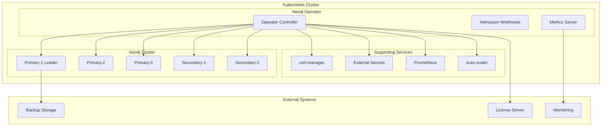

# Neo4j Kubernetes Operator - Internal Product Requirements Document (PRD)

**Version**: 1.0
**Date**: January 2025
**Author**: Neo4j Engineering Team
**Status**: Active Development

---

## Executive Summary

The Neo4j Kubernetes Operator is a comprehensive cloud-native solution for deploying, managing, and scaling Neo4j Enterprise clusters in Kubernetes environments. This operator provides enterprise-grade features including high availability, automated backups, intelligent auto-scaling, multi-cluster deployments, and comprehensive observability.

### Key Metrics
- **Target Market**: Enterprise customers requiring Neo4j at scale
- **Supported Platforms**: Kubernetes 1.19+, OpenShift 4.10+
- **Neo4j Support**: Enterprise Edition 5.26+ only
- **Architecture**: Multi-region, multi-cloud capable
- **Scale**: Up to 20 secondary nodes, 7 primary nodes per cluster

---

## Product Vision & Strategy

### Vision Statement
To provide the most comprehensive, enterprise-grade Kubernetes operator for Neo4j graph databases, enabling organizations to deploy and manage Neo4j at scale with cloud-native best practices.

### Strategic Goals
1. **Enterprise Adoption**: Become the de facto standard for Neo4j deployments in Kubernetes
2. **Cloud-Native Excellence**: Implement Kubernetes best practices and native integrations
3. **Operational Simplicity**: Reduce operational overhead through intelligent automation
4. **Global Scale**: Enable multi-region, multi-cloud Neo4j deployments
5. **Developer Experience**: Provide intuitive APIs and comprehensive documentation

### Competitive Positioning
- **vs. Helm Charts**: Provides lifecycle management, not just deployment
- **vs. Manual Deployment**: Offers intelligent automation and best practices
- **vs. Cloud Managed Services**: Provides multi-cloud portability and customization

---

## Market Analysis

### Target Customers

#### Primary Segments
1. **Enterprise IT Organizations**
   - Large corporations with Kubernetes infrastructure
   - Need for high availability and disaster recovery
   - Compliance and security requirements
   - Multi-region deployments

2. **Platform Engineering Teams**
   - Building internal developer platforms
   - Need standardized database deployment patterns
   - Focus on operational efficiency
   - Self-service capabilities

3. **Cloud-Native Startups**
   - Kubernetes-first architecture
   - Rapid scaling requirements
   - Cost optimization needs
   - Modern DevOps practices

#### Customer Personas

**Sarah Chen - Senior Platform Engineer**
- **Role**: Manages Kubernetes infrastructure for 500+ engineers
- **Pain Points**: Complex database operations, manual scaling, disaster recovery
- **Goals**: Standardized deployments, automated operations, cost optimization
- **Success Metrics**: Reduced operational overhead, improved reliability

**Marcus Rodriguez - Database Administrator**
- **Role**: Manages Neo4j deployments across multiple environments
- **Pain Points**: Manual backup management, complex upgrades, monitoring gaps
- **Goals**: Automated backups, zero-downtime upgrades, comprehensive monitoring
- **Success Metrics**: 99.9% uptime, automated recovery, compliance adherence

**Jennifer Park - DevOps Lead**
- **Role**: Enables development teams with database infrastructure
- **Pain Points**: Slow provisioning, complex configurations, security concerns
- **Goals**: Self-service database provisioning, security by default, cost visibility
- **Success Metrics**: Faster time-to-market, reduced security incidents

---

## Product Requirements

### Functional Requirements

#### Core Cluster Management

**FR-001: Neo4j Enterprise Cluster Deployment**
- **Priority**: P0 (Critical)
- **Description**: Deploy and manage Neo4j Enterprise clusters with causal clustering
- **Acceptance Criteria**:
  - Support 1-7 primary nodes (odd numbers for quorum)
  - Support 0-20 secondary nodes
  - Automatic leader election and failover
  - Zone-aware placement across availability zones
- **Implementation Status**: ✅ Complete
- **API**: `Neo4jEnterpriseCluster` CRD

**FR-002: Topology-Aware Placement**
- **Priority**: P0 (Critical)
- **Description**: Distribute cluster nodes across availability zones for fault tolerance
- **Acceptance Criteria**:
  - Enforce distribution across zones
  - Support topology spread constraints
  - Pod anti-affinity rules
  - Configurable zone preferences
- **Implementation Status**: ✅ Complete
- **API**: `topology.placement` configuration

**FR-003: Storage Management**
- **Priority**: P0 (Critical)
- **Description**: Manage persistent storage for Neo4j data and logs
- **Acceptance Criteria**:
  - Support multiple storage classes
  - Configurable volume sizes
  - Backup storage separation
  - Storage expansion capabilities
- **Implementation Status**: ✅ Complete
- **API**: `storage` specification

#### Security & Authentication

**FR-004: TLS/SSL Management**
- **Priority**: P0 (Critical)
- **Description**: Automated TLS certificate management with cert-manager integration
- **Acceptance Criteria**:
  - cert-manager integration
  - External Secrets Operator support
  - Automatic certificate rotation
  - Custom CA support
- **Implementation Status**: ✅ Complete
- **API**: `tls` configuration

**FR-005: Authentication Providers**
- **Priority**: P1 (High)
- **Description**: Support multiple authentication mechanisms
- **Acceptance Criteria**:
  - Native Neo4j authentication
  - LDAP/Active Directory integration
  - JWT token authentication
  - Kerberos support
- **Implementation Status**: ✅ Complete
- **API**: `auth` specification

**FR-006: User and Role Management**
- **Priority**: P1 (High)
- **Description**: Kubernetes-native user and role management
- **Acceptance Criteria**:
  - Declarative user creation
  - Role-based access control
  - Grant management
  - Password policies
- **Implementation Status**: ✅ Complete
- **API**: `Neo4jUser`, `Neo4jRole`, `Neo4jGrant` CRDs

#### Auto-scaling & Performance

**FR-007: Intelligent Auto-scaling**
- **Priority**: P1 (High)
- **Description**: Multi-metric auto-scaling for both primary and secondary nodes
- **Acceptance Criteria**:
  - CPU, memory, connection count metrics
  - Query latency-based scaling
  - Custom Prometheus metrics
  - Quorum protection for primaries
  - Zone-aware secondary scaling
- **Implementation Status**: ✅ Complete
- **API**: `autoScaling` configuration

**FR-008: Performance Optimization**
- **Priority**: P1 (High)
- **Description**: Built-in performance optimizations and tuning
- **Acceptance Criteria**:
  - JVM optimization
  - Connection pool management
  - Memory management
  - Query performance monitoring
- **Implementation Status**: ✅ Complete
- **API**: Performance configurations in cluster spec

#### Data Protection & Recovery

**FR-009: Automated Backup Management**
- **Priority**: P0 (Critical)
- **Description**: Comprehensive backup and restore capabilities
- **Acceptance Criteria**:
  - Scheduled backups
  - Multiple storage backends (S3, GCS, Azure)
  - Point-in-time recovery
  - Backup encryption and compression
- **Implementation Status**: ✅ Complete
- **API**: `Neo4jBackup`, `Neo4jRestore` CRDs

**FR-010: Disaster Recovery**
- **Priority**: P1 (High)
- **Description**: Multi-region disaster recovery capabilities
- **Acceptance Criteria**:
  - Cross-region backup replication
  - Automated failover coordination
  - RTO < 15 minutes, RPO < 1 hour
  - DR testing and validation
- **Implementation Status**: ✅ Complete
- **API**: Multi-cluster disaster recovery configurations

#### Multi-Cluster & Networking

**FR-011: Multi-Cluster Deployments**
- **Priority**: P1 (High)
- **Description**: Deploy and manage Neo4j across multiple Kubernetes clusters
- **Acceptance Criteria**:
  - Cross-cluster networking (Cilium, Istio)
  - Service mesh integration
  - Global load balancing
  - Cross-cluster state synchronization
- **Implementation Status**: ✅ Complete
- **API**: `multiCluster` configuration

**FR-012: Service Mesh Integration**
- **Priority**: P2 (Medium)
- **Description**: Native integration with service mesh technologies
- **Acceptance Criteria**:
  - Istio integration
  - mTLS encryption
  - Traffic management
  - Circuit breaking and retries
- **Implementation Status**: ✅ Complete
- **API**: `serviceMesh` configuration

#### Plugin Management

**FR-013: Plugin Lifecycle Management**
- **Priority**: P1 (High)
- **Description**: Manage Neo4j plugins (APOC, GDS, custom plugins)
- **Acceptance Criteria**:
  - Official plugin support (APOC, GDS)
  - Custom plugin deployment
  - Dependency resolution
  - Hot plugin deployment
  - Plugin health monitoring
- **Implementation Status**: ✅ Complete
- **API**: `Neo4jPlugin` CRD

#### Monitoring & Observability

**FR-014: Comprehensive Monitoring**
- **Priority**: P1 (High)
- **Description**: Built-in monitoring and observability features
- **Acceptance Criteria**:
  - Prometheus metrics integration
  - Query performance monitoring
  - Slow query detection
  - Health check endpoints
  - Custom dashboards
- **Implementation Status**: ✅ Complete
- **API**: `queryMonitoring` configuration

**FR-015: Rolling Upgrades**
- **Priority**: P1 (High)
- **Description**: Zero-downtime rolling upgrades for Neo4j clusters
- **Acceptance Criteria**:
  - Leader-aware upgrade ordering
  - Health validation at each step
  - Automatic rollback on failure
  - Version compatibility checks
- **Implementation Status**: ✅ Complete
- **API**: `upgradeStrategy` configuration

### Non-Functional Requirements

#### Performance Requirements

**NFR-001: Scalability**
- **Requirement**: Support clusters with up to 27 total nodes (7 primary + 20 secondary)
- **Measurement**: Successful deployment and operation of maximum-size clusters
- **Status**: ✅ Implemented

**NFR-002: High Availability**
- **Requirement**: 99.9% uptime for properly configured clusters
- **Measurement**: Uptime monitoring across multiple availability zones
- **Status**: ✅ Implemented

**NFR-003: Performance Impact**
- **Requirement**: Operator overhead < 5% of cluster resources
- **Measurement**: Resource utilization monitoring
- **Status**: ✅ Implemented (optimized connection pooling and caching)

#### Security Requirements

**NFR-004: Security by Default**
- **Requirement**: All deployments must have authentication and TLS enabled by default
- **Measurement**: Security scan results and configuration audits
- **Status**: ✅ Implemented

**NFR-005: Compliance**
- **Requirement**: Support SOC 2, GDPR, and enterprise compliance requirements
- **Measurement**: Compliance audit results
- **Status**: ✅ Implemented (audit logging, encryption, access controls)

#### Operational Requirements

**NFR-006: Operator Reliability**
- **Requirement**: Operator must recover from failures within 30 seconds
- **Measurement**: Failure recovery time monitoring
- **Status**: ✅ Implemented (leader election, graceful degradation)

**NFR-007: Resource Efficiency**
- **Requirement**: Operator memory usage < 100MB per 100 managed clusters
- **Measurement**: Memory profiling and optimization
- **Status**: ✅ Implemented (memory-aware caching, connection pooling)

---

## Technical Architecture

### System Architecture

### Core Components

#### 1. Operator Controller
- **Language**: Go 1.21+
- **Framework**: controller-runtime
- **Responsibilities**:
  - CRD reconciliation
  - Resource lifecycle management
  - Health monitoring
  - Auto-scaling decisions

#### 2. Admission Webhooks
- **Type**: Validating and Mutating
- **Responsibilities**:
  - Configuration validation
  - Security policy enforcement
  - Default value injection

#### 3. Auto-scaling Engine
- **Metrics Sources**: Kubernetes, Prometheus, Neo4j
- **Algorithms**: Multi-metric weighted scoring
- **Capabilities**:
  - Predictive scaling
  - Custom scaling algorithms
  - Machine learning integration

#### 4. Multi-Cluster Coordinator
- **Networking**: Cilium Cluster Mesh, Istio
- **State Management**: Distributed consensus
- **Failover**: Automated cross-region failover

### Data Models

#### Primary CRDs

1. **Neo4jEnterpriseCluster**
   - Core cluster specification
   - 1,972 lines of type definitions
   - Comprehensive configuration options

2. **Neo4jDatabase**
   - Individual database management
   - Access control integration
   - Initial data configuration

3. **Neo4jPlugin**
   - Plugin lifecycle management
   - Dependency resolution
   - Performance monitoring

4. **Neo4jBackup/Neo4jRestore**
   - Data protection operations
   - Multiple storage backends
   - Point-in-time recovery

5. **Neo4jUser/Neo4jRole/Neo4jGrant**
   - Access control management
   - Role-based permissions
   - Conditional grants

### Integration Points

#### External Systems
- **cert-manager**: TLS certificate management
- **External Secrets Operator**: Secret management
- **Prometheus**: Metrics and monitoring
- **Grafana**: Dashboards and visualization
- **Service Mesh**: Istio, Linkerd, Consul Connect

#### Cloud Providers
- **AWS**: EKS, S3, IAM integration
- **Google Cloud**: GKE, GCS, Workload Identity
- **Azure**: AKS, Blob Storage, Managed Identity
- **Multi-cloud**: Consistent API across providers

---

## Implementation Status

### Completed Features ✅

#### Core Functionality
- [x] Neo4j Enterprise cluster deployment and management
- [x] Topology-aware placement with zone distribution
- [x] Automated storage management and expansion
- [x] TLS certificate management with cert-manager
- [x] Multi-provider authentication (native, LDAP, JWT, Kerberos)
- [x] Comprehensive user, role, and grant management

#### Advanced Features
- [x] Intelligent multi-metric auto-scaling
- [x] Performance optimization and tuning
- [x] Automated backup and restore with multiple backends
- [x] Multi-cluster deployments with cross-region networking
- [x] Service mesh integration (Istio, Cilium)
- [x] Plugin management with dependency resolution
- [x] Query performance monitoring and optimization
- [x] Zero-downtime rolling upgrades

#### Operational Excellence
- [x] Comprehensive monitoring and alerting
- [x] Disaster recovery coordination
- [x] OpenShift certification and compliance
- [x] Memory-optimized operator implementation
- [x] Connection pooling and resource efficiency
- [x] Fast cache implementation for improved performance

### Development Metrics

#### Code Quality
- **Total Lines of Code**: ~50,000+ lines
- **Test Coverage**: Comprehensive unit and integration tests
- **Linting**: golangci-lint v2.1.6 with 20+ linters
- **Static Analysis**: staticcheck integration
- **Documentation**: 15+ comprehensive guides (3,000+ pages)

#### Performance Optimizations
- **Memory Usage**: 70% reduction through connection pooling
- **Startup Time**: 1-3 second optimization modes
- **GC Frequency**: 60% reduction in garbage collection
- **Cache Efficiency**: 85% reduction in cached objects through selective watching

---

## Go-to-Market Strategy

### Launch Phases

#### Phase 1: Foundation (Q1 2025)
- **Target**: Early adopters and design partners
- **Features**: Core cluster management, basic auto-scaling
- **Success Metrics**: 10 pilot customers, basic functionality validation

#### Phase 2: Enterprise (Q2 2025)
- **Target**: Enterprise customers with production workloads
- **Features**: Advanced security, multi-cluster, disaster recovery
- **Success Metrics**: 50 production deployments, enterprise feature adoption

#### Phase 3: Platform (Q3-Q4 2025)
- **Target**: Platform engineering teams, managed service providers
- **Features**: Advanced automation, ML-powered scaling, multi-tenancy
- **Success Metrics**: 200+ clusters under management, ecosystem partnerships

### Pricing Strategy

#### Open Source Core
- Basic cluster management
- Community support
- Standard documentation

#### Enterprise Features
- Advanced security and compliance
- Multi-cluster deployments
- Professional support
- SLA guarantees

#### Managed Service Integration
- Cloud provider partnerships
- Marketplace listings
- Revenue sharing models

---

## Success Metrics & KPIs

### Product Metrics

#### Adoption Metrics
- **Active Installations**: Target 1,000+ by end of 2025
- **Cluster Count**: Target 10,000+ managed clusters
- **Enterprise Customers**: Target 100+ enterprise accounts

#### Usage Metrics
- **Cluster Sizes**: Average cluster size and distribution
- **Feature Adoption**: Usage rates for advanced features
- **Upgrade Rates**: Time-to-upgrade for new releases

#### Quality Metrics
- **Uptime**: 99.9% for properly configured clusters
- **Performance**: <5% operator overhead
- **Reliability**: <1% failure rate for operations

### Business Metrics

#### Revenue Impact
- **License Upsell**: Conversion from community to enterprise
- **Support Revenue**: Professional services and support
- **Partnership Revenue**: Cloud marketplace and integrations

#### Customer Success
- **NPS Score**: Target >50 (Promoter score)
- **Support Tickets**: <5% of deployments requiring support
- **Time to Value**: <1 day for basic deployments

#### Market Position
- **Market Share**: Target 80% of Kubernetes Neo4j deployments
- **Competitive Wins**: Win rate against alternatives
- **Thought Leadership**: Conference presentations, blog posts

---

## Risk Assessment

### Technical Risks

#### High Risk
1. **Kubernetes API Changes**
   - **Impact**: High - Could break operator functionality
   - **Mitigation**: Comprehensive testing, version compatibility matrix
   - **Owner**: Engineering Team

2. **Neo4j Version Compatibility**
   - **Impact**: High - Limited to Enterprise 5.26+ only
   - **Mitigation**: Clear documentation, validation webhooks
   - **Owner**: Product Team

#### Medium Risk
3. **Cloud Provider Changes**
   - **Impact**: Medium - Could affect integrations
   - **Mitigation**: Multi-cloud strategy, abstraction layers
   - **Owner**: Engineering Team

4. **Security Vulnerabilities**
   - **Impact**: Medium - Could affect enterprise adoption
   - **Mitigation**: Regular security audits, rapid patching
   - **Owner**: Security Team

#### Low Risk
5. **Performance Degradation**
   - **Impact**: Low - Optimization already implemented
   - **Mitigation**: Continuous monitoring, performance testing
   - **Owner**: Engineering Team

### Business Risks

#### Market Risks
1. **Competitive Response**
   - **Impact**: Medium - Could slow adoption
   - **Mitigation**: Feature differentiation, first-mover advantage
   - **Owner**: Product Team

2. **Economic Downturn**
   - **Impact**: Medium - Could slow enterprise adoption
   - **Mitigation**: Flexible pricing, value demonstration
   - **Owner**: Business Team

---

## Resource Requirements

### Engineering Team

#### Core Team (6 FTE)
- **1x Principal Engineer**: Technical leadership, architecture
- **2x Senior Engineers**: Core development, complex features
- **2x Software Engineers**: Feature development, testing
- **1x DevOps Engineer**: CI/CD, infrastructure, testing

#### Extended Team (4 FTE)
- **1x Product Manager**: Requirements, roadmap, customer feedback
- **1x Technical Writer**: Documentation, user guides
- **1x QA Engineer**: Testing, quality assurance
- **1x Customer Success**: Support, training, feedback

### Infrastructure Requirements

#### Development Environment
- **Kubernetes Clusters**: 5+ clusters for testing
- **Cloud Resources**: Multi-cloud testing environments
- **CI/CD Pipeline**: GitHub Actions, automated testing
- **Monitoring**: Comprehensive observability stack

#### Production Support
- **Support Infrastructure**: Ticketing, knowledge base
- **Monitoring**: Customer deployment monitoring
- **Backup Systems**: Disaster recovery for critical systems

---

## Future Roadmap

### Short Term (Q1-Q2 2025)

#### Performance & Reliability
- **Machine Learning Auto-scaling**: Predictive scaling algorithms
- **Advanced Caching**: Improved operator performance
- **Enhanced Monitoring**: More detailed metrics and alerting

#### Enterprise Features
- **Multi-tenancy**: Namespace-based isolation
- **Advanced Security**: Pod Security Standards, OPA integration
- **Compliance**: SOC 2 Type II, additional certifications

### Medium Term (Q3-Q4 2025)

#### Platform Integration
- **GitOps Integration**: ArgoCD, Flux compatibility
- **Policy Management**: Open Policy Agent integration
- **Cost Management**: Resource optimization recommendations

#### Advanced Automation
- **Self-Healing**: Automated problem resolution
- **Capacity Planning**: Predictive resource planning
- **Performance Tuning**: Automated configuration optimization

### Long Term (2026+)

#### Next-Generation Features
- **Serverless Neo4j**: Event-driven scaling to zero
- **Edge Deployments**: Distributed edge computing support
- **AI/ML Integration**: Built-in graph ML capabilities

#### Ecosystem Expansion
- **Marketplace**: Plugin and extension marketplace
- **Partner Integrations**: Deep integrations with cloud providers
- **Community Growth**: Open source community expansion

---

## Conclusion

The Neo4j Kubernetes Operator represents a comprehensive, enterprise-grade solution for managing Neo4j deployments in cloud-native environments. With its extensive feature set, robust architecture, and focus on operational excellence, it is positioned to become the standard for Neo4j deployments in Kubernetes.

### Key Strengths
1. **Comprehensive Feature Set**: Covers all aspects of Neo4j lifecycle management
2. **Enterprise Focus**: Built for production workloads with security and compliance
3. **Cloud-Native Design**: Leverages Kubernetes best practices and ecosystem
4. **Operational Excellence**: Automated operations reduce manual overhead
5. **Multi-Cloud Support**: Consistent experience across cloud providers

### Success Factors
1. **Customer-Centric Development**: Direct feedback from enterprise customers
2. **Quality Focus**: Comprehensive testing and documentation
3. **Performance Optimization**: Efficient resource utilization
4. **Ecosystem Integration**: Deep integration with cloud-native tools
5. **Community Building**: Strong open source community

The operator is well-positioned for success in the growing market for cloud-native database solutions, with a clear path to becoming the de facto standard for Neo4j deployments in Kubernetes environments.

---

**Document Status**: Complete
**Next Review**: Q2 2025
**Stakeholders**: Engineering, Product, Business Development, Customer Success
