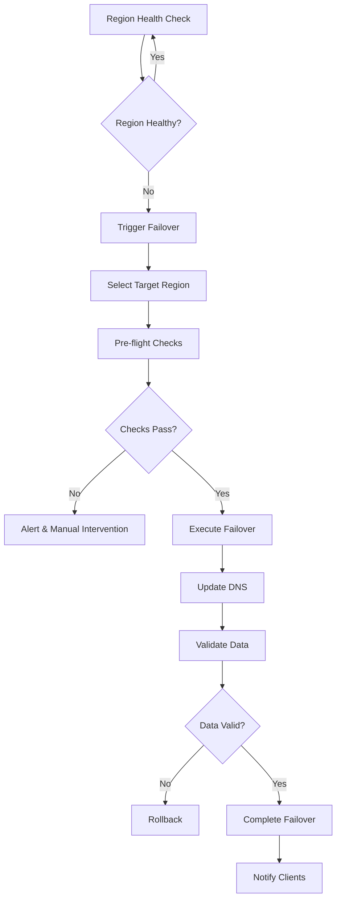

# Multi-Region/DR Implementation Plan

**Date**: 2025-01-28
**Feature**: Cross-Region Clusters and Automated Failover
**Priority**: High
**Estimated Timeline**: 10 weeks

## Executive Summary

This document outlines the implementation plan for multi-region deployment and disaster recovery capabilities in the Neo4j Kubernetes Operator. This feature enables Neo4j clusters to span multiple regions with automated failover, providing true disaster recovery with RPO < 1 minute and RTO < 5 minutes.

## Problem Statement

### Current State
- Single region cluster support only
- Manual backup/restore for disaster recovery
- No cross-region networking automation
- No automated failover mechanisms
- Limited to single Kubernetes cluster deployments

### Business Impact
- **Disaster Risk**: Complete outage on region failure
- **Data Loss**: Potential hours of data loss
- **Recovery Time**: Hours to days for manual recovery
- **Global Performance**: No geo-distributed read capabilities
- **Compliance**: Cannot meet data residency requirements

## Technical Design

### Architecture Overview

```
┌─────────────────────────────────────────────────────────────────┐
│                     Global Neo4j Cluster                         │
├─────────────────────────────────────────────────────────────────┤
│                                                                 │
│  ┌─────────────────┐  ┌─────────────────┐  ┌─────────────────┐ │
│  │   US-EAST-1     │  │   EU-WEST-1     │  │   AP-SOUTH-1    │ │
│  │  (Primary)      │  │  (Secondary)     │  │  (Secondary)     │ │
│  │                 │  │                 │  │                 │ │
│  │  ┌───────────┐  │  │  ┌───────────┐  │  │  ┌───────────┐  │ │
│  │  │ Primary 1 │  │  │  │ Primary 4 │  │  │  │Secondary 1│  │ │
│  │  │ Primary 2 │  │  │  │Secondary 2│  │  │  │Secondary 2│  │ │
│  │  │ Primary 3 │  │  │  │Secondary 3│  │  │  │Secondary 3│  │ │
│  │  └───────────┘  │  │  └───────────┘  │  │  └───────────┘  │ │
│  └────────┬─────────┘  └────────┬─────────┘  └────────┬─────────┘ │
│           │                      │                      │         │
│  ┌────────▼──────────────────────▼──────────────────────▼────────┐ │
│  │                    Cross-Region Network Mesh                   │ │
│  │  ┌──────────┐  ┌──────────────┐  ┌────────────────────────┐  │ │
│  │  │   VPN    │  │Service Mesh  │  │  Global Load Balancer  │  │ │
│  │  │  Tunnels │  │ (Istio/SNI) │  │    (Route53/GSLB)      │  │ │
│  │  └──────────┘  └──────────────┘  └────────────────────────┘  │ │
│  └────────────────────────────────────────────────────────────────┘ │
│                                                                   │
│  ┌───────────────────────────────────────────────────────────────┐ │
│  │                  Global Control Plane                          │ │
│  │  ┌─────────────┐  ┌──────────────┐  ┌───────────────────┐   │ │
│  │  │   Global    │  │   Failover   │  │    Monitoring     │   │ │
│  │  │ Coordinator │  │  Controller  │  │   & Analytics     │   │ │
│  │  └─────────────┘  └──────────────┘  └───────────────────┘   │ │
│  └───────────────────────────────────────────────────────────────┘ │
└─────────────────────────────────────────────────────────────────────┘
```

### Core Components

#### 1. Global Cluster CRD (`api/v1alpha1/neo4jglobalcluster_types.go`)
```go
type Neo4jGlobalCluster struct {
    metav1.TypeMeta   `json:",inline"`
    metav1.ObjectMeta `json:"metadata,omitempty"`

    Spec   Neo4jGlobalClusterSpec   `json:"spec,omitempty"`
    Status Neo4jGlobalClusterStatus `json:"status,omitempty"`
}

type Neo4jGlobalClusterSpec struct {
    // Global configuration
    GlobalConfig GlobalConfiguration `json:"globalConfig"`

    // Region definitions
    Regions []RegionSpec `json:"regions"`

    // Network mesh configuration
    NetworkMesh NetworkMeshSpec `json:"networkMesh"`

    // Failover policy
    FailoverPolicy FailoverPolicySpec `json:"failoverPolicy"`

    // Global load balancing
    LoadBalancing GlobalLoadBalancingSpec `json:"loadBalancing"`

    // Data residency rules
    DataResidency *DataResidencySpec `json:"dataResidency,omitempty"`
}

type RegionSpec struct {
    Name string `json:"name"`

    // Kubernetes cluster connection
    KubeConfig SecretReference `json:"kubeConfig"`

    // Region role
    Role RegionRole `json:"role"` // primary, secondary, read-replica

    // Topology configuration
    Topology RegionTopology `json:"topology"`

    // Network configuration
    Network RegionNetworkConfig `json:"network"`

    // Zone/datacenter info
    Zone string `json:"zone"`

    // Priority for failover
    Priority int `json:"priority"`
}
```

#### 2. Multi-Region Controller (`internal/controller/multiregion_controller.go`)
```go
type MultiRegionController struct {
    globalCoordinator *GlobalCoordinator
    regionManagers    map[string]*RegionManager
    networkManager    *NetworkMeshManager
    failoverController *FailoverController

    // Reconciliation
    Reconcile(ctx context.Context, req ctrl.Request) (ctrl.Result, error)

    // Region management
    CreateRegion(spec RegionSpec) error
    UpdateRegion(name string, spec RegionSpec) error
    DeleteRegion(name string) error

    // Failover orchestration
    InitiateFailover(from, to string) error
    ValidateFailover() error
    CompleteFailover() error
}
```

#### 3. Network Mesh Manager (`internal/multiregion/network_mesh.go`)
```go
type NetworkMeshManager struct {
    provider     NetworkProvider
    regions      map[string]*RegionNetwork
    meshTopology *MeshTopology

    // Network setup
    EstablishMesh(regions []RegionSpec) error

    // VPN/tunnel management
    CreateTunnel(source, target string) error

    // Service mesh integration
    ConfigureServiceMesh() error

    // DNS management
    UpdateGlobalDNS() error
}
```

#### 4. Failover Controller (`internal/multiregion/failover_controller.go`)
```go
type FailoverController struct {
    policy          FailoverPolicy
    healthMonitor   *RegionHealthMonitor
    dataValidator   *DataConsistencyValidator
    dnsManager      *GlobalDNSManager

    // Health monitoring
    MonitorRegionHealth() error

    // Failover decision
    ShouldFailover(region string) bool
    SelectFailoverTarget(failed string) string

    // Failover execution
    ExecuteFailover(from, to string) error

    // Validation
    ValidateDataConsistency() error

    // Rollback
    RollbackFailover() error
}
```

### Network Architecture

#### Cross-Region Connectivity
```yaml
# Network mesh configuration
networkMesh:
  provider: wireguard  # or ipsec, istio

  tunnels:
    - name: us-east-to-eu-west
      source:
        region: us-east-1
        endpoint: vpn-us.company.com
        subnet: 10.1.0.0/16
      target:
        region: eu-west-1
        endpoint: vpn-eu.company.com
        subnet: 10.2.0.0/16
      encryption:
        algorithm: AES-256-GCM
        keyRotation: 24h

    - name: us-east-to-ap-south
      source:
        region: us-east-1
        endpoint: vpn-us.company.com
        subnet: 10.1.0.0/16
      target:
        region: ap-south-1
        endpoint: vpn-ap.company.com
        subnet: 10.3.0.0/16

  routing:
    mode: dynamic  # BGP
    preferences:
      - path: direct
        weight: 100
      - path: transit
        weight: 50
```

#### Service Mesh Integration
```yaml
# Istio multi-cluster configuration
apiVersion: install.istio.io/v1alpha1
kind: IstioOperator
metadata:
  name: neo4j-multicluster
spec:
  values:
    pilot:
      env:
        PILOT_ENABLE_WORKLOAD_ENTRY_AUTOREGISTRATION: true
    global:
      meshID: neo4j-global-mesh
      multiCluster:
        clusterName: us-east-1
      network: network-us-east
```

## Implementation Plan

### Phase 1: Foundation (Week 1-2)

#### Week 1
- [ ] Design Neo4jGlobalCluster CRD
- [ ] Create multi-cluster client abstraction
- [ ] Implement region discovery
- [ ] Add cross-cluster RBAC

#### Week 2
- [ ] Create GlobalCoordinator component
- [ ] Implement RegionManager
- [ ] Add multi-cluster state storage
- [ ] Create region health monitoring

### Phase 2: Network Mesh (Week 3-4)

#### Week 3
- [ ] Implement NetworkMeshManager
- [ ] Add WireGuard tunnel support
- [ ] Create service discovery bridge
- [ ] Implement cross-region DNS

#### Week 4
- [ ] Add Istio multi-cluster support
- [ ] Implement traffic routing policies
- [ ] Create network performance monitoring
- [ ] Add encryption and security

### Phase 3: Cluster Management (Week 5-6)

#### Week 5
- [ ] Implement cross-region cluster formation
- [ ] Add replica placement logic
- [ ] Create data synchronization monitor
- [ ] Implement read preference routing

#### Week 6
- [ ] Add configuration propagation
- [ ] Implement plugin synchronization
- [ ] Create backup coordination
- [ ] Add compliance controls

### Phase 4: Failover Automation (Week 7-8)

#### Week 7
- [ ] Create FailoverController
- [ ] Implement health assessment
- [ ] Add failover decision engine
- [ ] Create pre-flight checks

#### Week 8
- [ ] Implement failover execution
- [ ] Add DNS failover automation
- [ ] Create client notification system
- [ ] Implement rollback mechanism

### Phase 5: Integration and Testing (Week 9-10)

#### Week 9
- [ ] End-to-end integration testing
- [ ] Chaos testing with region failures
- [ ] Performance benchmarking
- [ ] Documentation creation

#### Week 10
- [ ] Production readiness review
- [ ] Runbook creation
- [ ] Training materials
- [ ] Final polish and optimization

## Configuration Examples

### Basic Multi-Region Setup
```yaml
apiVersion: neo4j.neo4j.com/v1alpha1
kind: Neo4jGlobalCluster
metadata:
  name: global-neo4j-prod
spec:
  globalConfig:
    neo4jVersion: "5.26.0"
    edition: enterprise

  regions:
    - name: us-east-1
      role: primary
      priority: 100
      kubeConfig:
        secretName: kubeconfig-us-east
      topology:
        primaries: 3
        secondaries: 2
      network:
        subnet: "10.1.0.0/16"
        endpoint: "neo4j-us.company.com"

    - name: eu-west-1
      role: secondary
      priority: 80
      kubeConfig:
        secretName: kubeconfig-eu-west
      topology:
        primaries: 2
        secondaries: 3
      network:
        subnet: "10.2.0.0/16"
        endpoint: "neo4j-eu.company.com"

  networkMesh:
    provider: wireguard
    encryption: true
    mtu: 1420

  failoverPolicy:
    automatic: true
    rpoMinutes: 1
    rtoMinutes: 5
    validationRequired: true

  loadBalancing:
    provider: route53
    geoRouting: true
    healthCheck:
      interval: 10s
      timeout: 5s
      threshold: 3
```

### Advanced Configuration with Data Residency
```yaml
apiVersion: neo4j.neo4j.com/v1alpha1
kind: Neo4jGlobalCluster
metadata:
  name: global-neo4j-compliance
spec:
  regions:
    - name: us-east-1
      role: primary
      priority: 100
      topology:
        primaries: 3
        secondaries: 2
      labels:
        compliance: "sox"
        dataClass: "pii"

    - name: eu-west-1
      role: primary  # Multi-primary for GDPR
      priority: 100
      topology:
        primaries: 3
        secondaries: 2
      labels:
        compliance: "gdpr"
        dataClass: "eu-pii"

    - name: ap-south-1
      role: read-replica
      priority: 50
      topology:
        primaries: 0
        secondaries: 5
      labels:
        purpose: "analytics"

  dataResidency:
    enabled: true
    rules:
      - name: eu-data-residency
        selector:
          labels:
            region: "eu"
        allowedRegions: ["eu-west-1"]
        replicationPolicy: "eu-only"

      - name: us-data-residency
        selector:
          labels:
            region: "us"
        allowedRegions: ["us-east-1", "us-west-2"]

  failoverPolicy:
    automatic: true
    constraints:
      - type: data-residency
        enforce: strict
      - type: compliance
        enforce: strict
    manualApproval:
      required: true
      approvers: ["oncall-team", "compliance-team"]
```

## Testing Strategy

### Integration Tests
```go
var _ = Describe("Multi-Region Deployment", func() {
    It("should create cross-region cluster", func() {
        // Create global cluster
        globalCluster := &v1alpha1.Neo4jGlobalCluster{
            ObjectMeta: metav1.ObjectMeta{
                Name: "test-global",
            },
            Spec: v1alpha1.Neo4jGlobalClusterSpec{
                Regions: []v1alpha1.RegionSpec{
                    {Name: "us-east-1", Role: "primary"},
                    {Name: "eu-west-1", Role: "secondary"},
                },
            },
        }

        Expect(k8sClient.Create(ctx, globalCluster)).To(Succeed())

        // Verify regional clusters created
        Eventually(func() bool {
            usCluster := getRegionalCluster("us-east-1")
            euCluster := getRegionalCluster("eu-west-1")
            return usCluster.Ready && euCluster.Ready
        }, 10*time.Minute).Should(BeTrue())

        // Verify cross-region connectivity
        Expect(testCrossRegionConnectivity()).To(Succeed())
    })
})
```

### Failover Tests
```go
func TestAutomatedFailover(t *testing.T) {
    // Setup multi-region cluster
    cluster := setupMultiRegionCluster(t)

    // Insert test data
    testData := insertTestData(cluster.PrimaryRegion())

    // Simulate region failure
    simulateRegionFailure("us-east-1")

    // Wait for failover
    require.Eventually(t, func() bool {
        status := cluster.Status()
        return status.PrimaryRegion == "eu-west-1"
    }, 5*time.Minute, 10*time.Second)

    // Verify data integrity
    recoveredData := readTestData(cluster.PrimaryRegion())
    require.Equal(t, testData, recoveredData)

    // Verify RPO
    dataLoss := calculateDataLoss(testData, recoveredData)
    require.Less(t, dataLoss, 1*time.Minute)
}
```

### Chaos Tests
```yaml
# Chaos test scenario
apiVersion: chaos-mesh.org/v1alpha1
kind: NetworkChaos
metadata:
  name: region-partition
spec:
  action: partition
  mode: all
  selector:
    labelSelectors:
      region: us-east-1
  direction: both
  target:
    selector:
      labelSelectors:
        region: eu-west-1
  duration: "5m"
```

## Monitoring and Observability

### Metrics
```go
var (
    multiRegionReplicationLag = prometheus.NewGaugeVec(
        prometheus.GaugeOpts{
            Name: "neo4j_multi_region_replication_lag_seconds",
            Help: "Replication lag between regions",
        },
        []string{"source", "target"},
    )

    regionHealthStatus = prometheus.NewGaugeVec(
        prometheus.GaugeOpts{
            Name: "neo4j_region_health_status",
            Help: "Health status of each region (1=healthy, 0=unhealthy)",
        },
        []string{"region"},
    )

    failoverDuration = prometheus.NewHistogram(
        prometheus.HistogramOpts{
            Name: "neo4j_failover_duration_seconds",
            Help: "Duration of failover operations",
            Buckets: []float64{30, 60, 120, 300, 600},
        },
    )

    crossRegionLatency = prometheus.NewHistogramVec(
        prometheus.HistogramOpts{
            Name: "neo4j_cross_region_latency_milliseconds",
            Help: "Network latency between regions",
        },
        []string{"source", "target"},
    )
)
```

### Alerting Rules
```yaml
groups:
  - name: multi-region
    rules:
      - alert: HighReplicationLag
        expr: neo4j_multi_region_replication_lag_seconds > 60
        for: 5m
        labels:
          severity: warning
        annotations:
          summary: "High replication lag between regions"

      - alert: RegionDown
        expr: neo4j_region_health_status == 0
        for: 2m
        labels:
          severity: critical
        annotations:
          summary: "Region {{ $labels.region }} is unhealthy"

      - alert: FailoverInProgress
        expr: increase(neo4j_failover_duration_seconds_count[5m]) > 0
        labels:
          severity: info
        annotations:
          summary: "Failover operation in progress"
```

## Disaster Recovery Procedures

### Automated Failover Flow


### Manual Failover Commands
```bash
# Check global cluster status
kubectl get neo4jglobalcluster global-neo4j-prod -o wide

# Initiate manual failover
kubectl patch neo4jglobalcluster global-neo4j-prod \
  --type='json' \
  -p='[{"op": "replace", "path": "/spec/failover/trigger", "value": "manual"}]'

# Validate failover
kubectl exec -it neo4j-client -- cypher-shell \
  "CALL dbms.cluster.overview()"

# Rollback failover
kubectl patch neo4jglobalcluster global-neo4j-prod \
  --type='json' \
  -p='[{"op": "replace", "path": "/spec/failover/rollback", "value": true}]'
```

## Success Criteria

### Technical Metrics
- **RPO**: < 1 minute data loss
- **RTO**: < 5 minutes recovery time
- **Replication Lag**: < 10 seconds (same continent)
- **Failover Success Rate**: > 99%
- **Data Consistency**: 100% after failover

### Business Metrics
- **Availability**: 99.99% globally
- **Performance**: < 100ms latency increase
- **Cost Efficiency**: < 30% overhead vs single region
- **Compliance**: 100% data residency adherence

## Risk Mitigation

### Technical Risks
- **Network Partition**: Implement split-brain detection
- **Data Divergence**: Use consensus protocols
- **Performance Degradation**: Async replication, read replicas
- **Security Exposure**: End-to-end encryption, mTLS

### Operational Risks
- **Complexity**: Comprehensive automation and tooling
- **Cost Overrun**: Resource optimization, auto-scaling
- **Compliance Violation**: Strict data residency enforcement
- **Skills Gap**: Training and documentation

## Future Enhancements

### Short Term (3 months)
- Edge location support
- Automated capacity planning
- Predictive failover
- Advanced routing policies

### Medium Term (6 months)
- Multi-cloud support
- Federated clusters
- AI-driven optimization
- Quantum-safe encryption

### Long Term (12 months)
- Serverless regions
- 5G edge integration
- Blockchain consensus
- Self-healing networks

## Conclusion

Multi-region deployment with automated disaster recovery transforms the Neo4j Kubernetes Operator into an enterprise-grade solution capable of meeting the most demanding availability and compliance requirements. By implementing cross-region clusters, automated failover, and intelligent data placement, organizations can achieve true 99.99% availability while maintaining data sovereignty and optimal performance.

The comprehensive approach covering network mesh, failover automation, and global load balancing ensures that Neo4j deployments can scale globally while maintaining consistency and performance. The 10-week implementation timeline delivers incremental value while building toward a complete disaster recovery solution.
